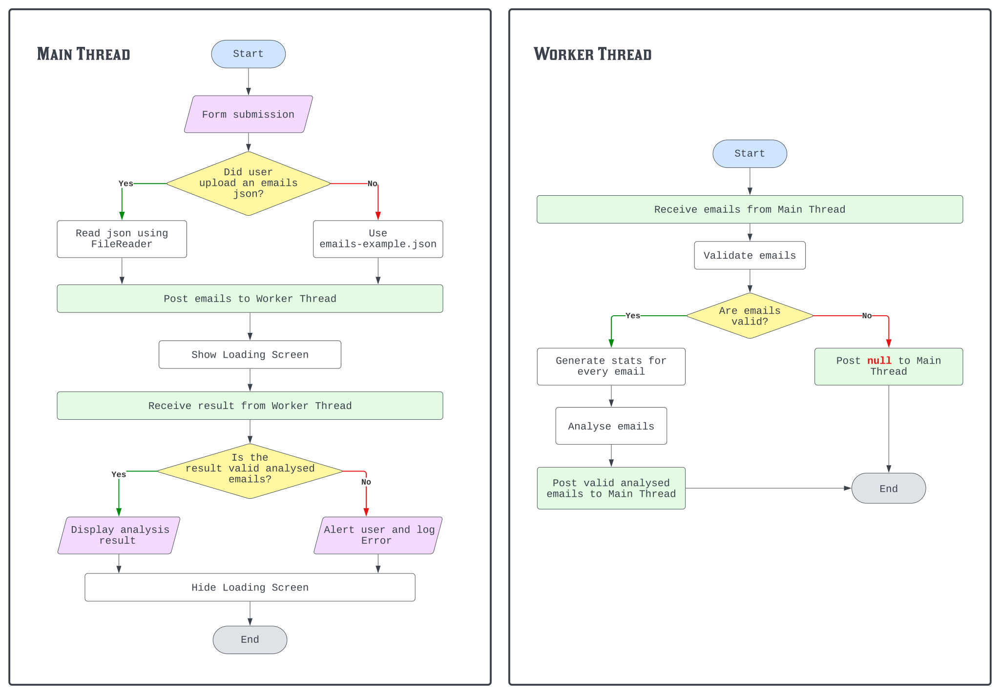
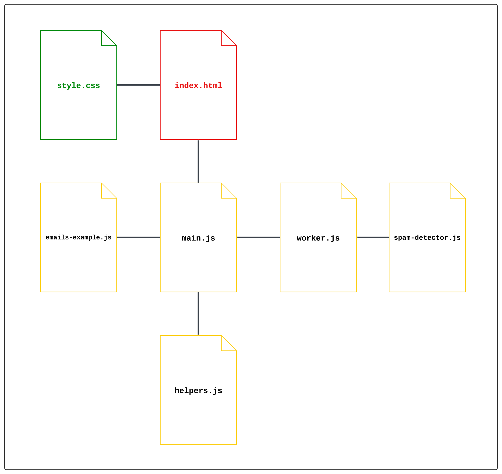

## Flow Chart

## Basic structure
- [`tests/`](../tests): Contains all the tests. [`jest/`](../tests/jest) for unit tests and [`cypress/`](../tests/cypress) for E2E
- [`public/`](../public): Actual app's code
- [`index.js`](../index.js): Runs the `express` server which serves the app locally

## Module structure

**NOTE:** The project uses ES Modules on the Front-End, and CommonJS modules on the Back-End. This is done because the project uses Jest for testing, and its ES Module support is still experimental at the time of writing this.

## Code structure
All the scripts are in the [`scripts/`](../public/scripts/) directory.

### [`main.js`](../public/scripts/main.js)
Contains the main thread code and is responsible for updating the UI.
- On form submit: posts the emails uploaded by the user (or the example emails: [`emails-example.json`](../public/scripts/emails-example.json), if the user didn't upload any) to the worker to be analysed.
- On worker message: it renders the analysis result on the page, if there is one. Otherwise it alerts the user that there's been an issue and logs the error to the console.

### [`helpers.js`](../public/scripts/helpers.js)
#### `displayAnalysis`
Takes as argument an object containing:
- `analysedEmails`: the analysed emails returned from the worker
- `analysisOutput`: the HTML element which will contain the result of the analysis
- `template`: a template HTML element to be used to create each email analysis card

Creates an analysis card for every analysed email and appends it to the `analysisOutput`

### [`worker.js`](../public/scripts/worker.js)
Contains the worker thread code.
1. Receives an email set to analyse
2. Uses `SpamDetector` to do the work
3. Posts the result of `SpamDetector.analyseEmails(emailsSet)` to the main thread

### [`spam-detector.js`](../public/scripts/spam-detector.js)
All `SpamDetector` methods are static.
All `SpamDetector` methods are private helpers except for `analyseEmails`.

#### `analyseEmails`
Takes an array of email objects as argument.
1. Uses the helper methods to: `validateEmails`, `generateStats` for each email, then using `getSimilarity` it compares every email to all the others in the set, pushing the result of the comparison into both compared emails' `similarityArray`
2. For each email, reduces the `similarityArray` to one value (the average): similarityTotal / comparisonsCount

Returns:
- When passed an invalid emails set: `null`
- When passed a valid set: an array of analysed emails

#### `getSimilarity`
- Helper private class method
- Takes as arguments: two email objects with stats. Uses their respective `words` array and `wordCount` to compare how similar the two are, using Levenstein distance on their words.

Returns:
- `0` if any of the two has a word count of zero (doesn't consider emails with empty bodies as similiar)
- a `number` representing a similarity percentage: 100 - ((wordsLavensteinDistance / greaterWordCount) * 100)

#### `generateStats`
- Helper private class method
- Takes as arguments: an email object. Uses its `body` property to generate: `words`; `wordCount`; and `uniqueWordsCount`

Return an object containing:
- All the email's initial properties
- The generated stats
- An empty `similarityArray`

#### `getUniqueWordsCount`
- Helper private class method
- Takes as arguments: an array of strings where every string is a word.

Returns: a `number` representing the count of unique words

#### `validateEmails`
- Helper private class method
- Takes as arguments: an array of emails

It considers the following as valid:
- An array of strings (every string represents the emails body)
- An array of objects where at least one of them contains a property `body` of type string

Returns:
- When valid: an array of objects where every object contains all the original email properties when applicable, plus a `body` property of type string
- When invalid: `null`
